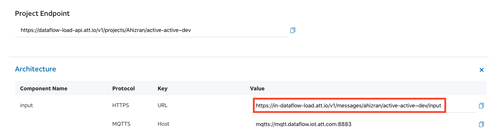
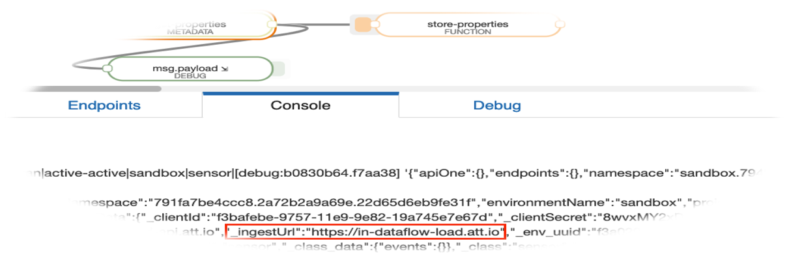

# Active Active Epic

## •	The task:

make sites east and west to be active for ingesting messages.

## •	The goal:**

Split the load between the two sites, and let the global host decide which site to send messages to.

## •	Micro services are affected:**

1)	Broker
2)	Snapshots
3)	Core
4)	Orchestration
5)	Charts/Charts museum

## •	Changes made to each micro service:**

### Orchestration

1)	Have each project created come up with host:in.dataflow.iot.att.com.

 

2)	Expose the host ingest URL to external data to allow node dataflow-out to retrieve and use it to ingest messages.

 

3)	Set time to leave for the spec compiled from the redis cache to one minute.
Core

1)	Replace base URL with ingest URL revealed by orchestration and use it to publish URL to dataflow.

### Snapshots

1)	Adds a query parameter (revision) to the function that the broker sends and save it to the Cassandra DB.

### Charts

1)	Adding a new host to value files in chart museum by the 
relevant environment and site.

2)	Add rules for a new host to ingress file and add tls for production host only.

3)	Add a new ingest URL host to configMap to allow orchestration MS to retrieve and use it.

### Broker

1)	Send the revision to snapshots whenever the broker saves streams.
Update and Tests

## •	Update process:
1)	projectone-orchestration  -> master_081819_083334_3  charts-museum ->0.0.127.
2)	projectone-snapshots  -> master_081819_072053_3 charts-museum -> 0.1.40.
3)	broker -> master_081819_074718_4 charts-museum -> 0.0.352.
4)	Core -> master_refactor_081819_130552_2.
5)	Base-image -> master_dev_081819_133050_24.
6)	Dataflow-common-config ->  0.0.20.

## •	Processes that was tested with ingest host
## using the manual editing of the charts: 
1)	Change the spec project located in east and check that it is also updated in the west.

2)	Send a message to the host: in-dataflow-load.att.io and check that the global host directs the messages to the relevant site.

3)	Send Message to host: in-east-dataflow-load.att.io and check that the message is posted to east site.

4)	Send Message to host: in-west-dataflow-load.att.io and check that the message is posted to west site.

5)	Tested in principle End-To-End tests by MS df-automation-tests. 

6)	But in the West site kafka returns an Error Timeout Exception.

 
## •	The temporary solution until Kafka is updated to mirror kafka

1)	Populate into the ingestUrl environment variable that is within the config map the value the system is currently working on api-public-url. So, we can make the system active on both sites by changing the value of the ingestUrl environment variable.

## •	Processes that need to be tested:

1)	Check the Active Active with the new registry.

2)	Replace the in-dataflow-load.att.io host with a public URL in environment variables and check that a system stops being active for both sites
